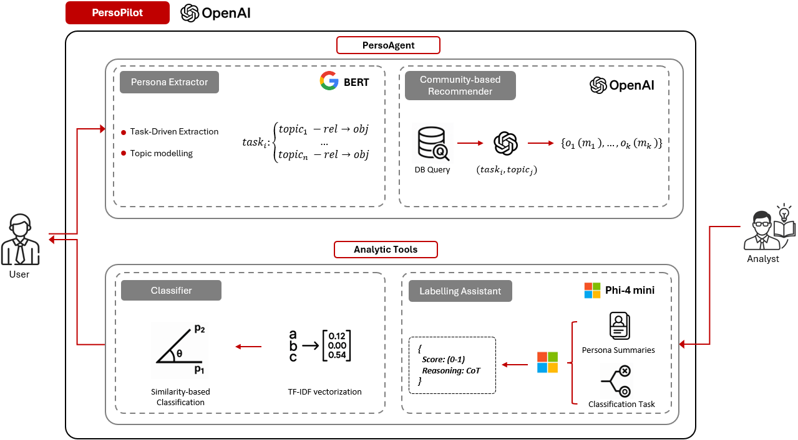
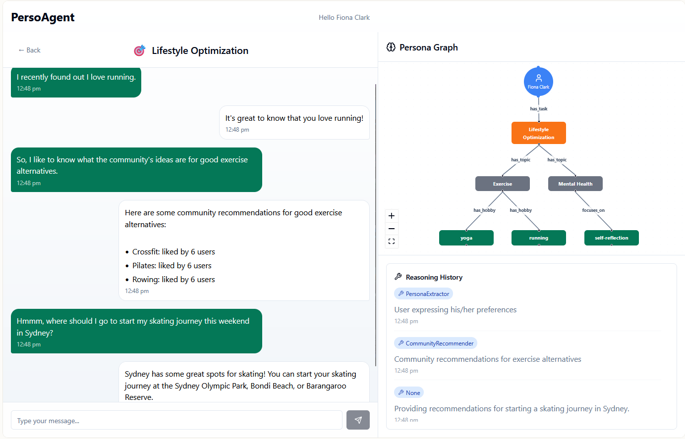
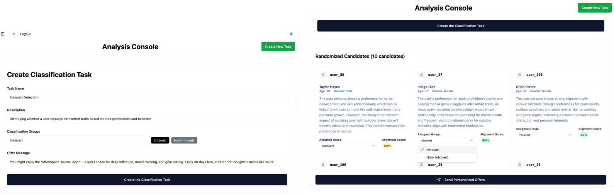
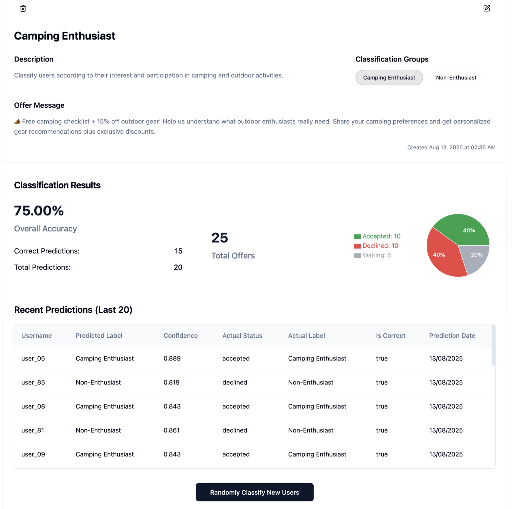

# PersoPilot
### An Adaptive AI-Copilot for Transparent Contextualized Persona Classification and Personalized Response Generation 


## Abstract
Understanding and classifying user personas is critical for delivering effective personalization. While persona information offers valuable insights, its full potential is realized only when it is contextualized, linking user characteristics with situational context to enable more precise and meaningful service provision. Existing systems often treat persona and context as separate inputs, limiting their ability to generate nuanced, adaptive interactions. To address this gap, we present PersoPilot, an agentic AI-Copilot that integrates persona understanding with contextual analysis to support both end users and analysts. End users interact through a transparent, explainable chat interface, where they can express preferences in natural language, request recommendations, and receive information tailored to their immediate task. On the analyst side, PersoPilot delivers a transparent, reasoning-powered labeling assistant, integrated with an active learning–driven classification process that adapts over time with new labeled data. This feedback loop enables targeted service recommendations and adaptive personalization, bridging the gap between raw persona data and actionable, context-aware insights.


## Figures

|  | 
|:----------------------------------------------------------:|
| Fig.1 - PersoPilot architecture overview.|


|  | 
|:----------------------------------------------------------:|
| Fig.2 - User interface (PersoAgent) screenshot.|


|  | 
|:----------------------------------------------------------:|
| Fig.3 - Analyst interface screenshots.|

|  | 
|:----------------------------------------------------------:|
| Fig.4 - Classification results.|


## Getting Started


**Use your preferred IDE**

If you want to work locally using your own IDE, you can clone this repo and push changes. Pushed changes will also be reflected in Lovable.

The only requirement is having Node.js & npm installed - [install with nvm](https://github.com/nvm-sh/nvm#installing-and-updating)

Follow these steps:

```sh
# Step 1: Clone the repository using the project's Git URL.
git clone github.com/salehafzoon/persoagent-start-now.git

# Step 2: Navigate to the project directory.
cd persoagent-start-now

# Step 3: Install the necessary dependencies.
npm i

# Step 4: Start the development server with auto-reloading and an instant preview.
npm run dev
```


